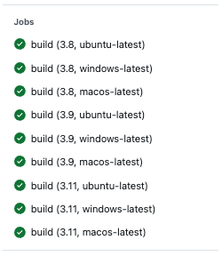
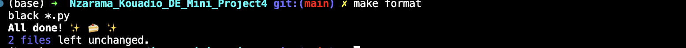
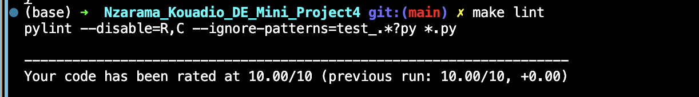
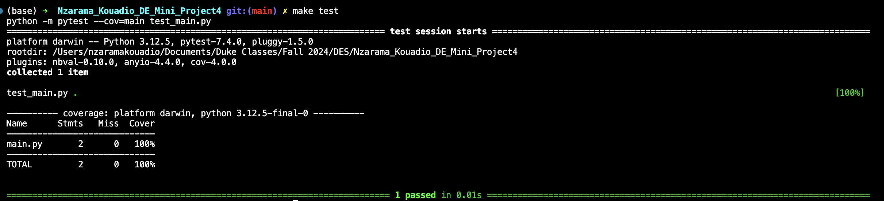

# Nzarama_Kouadio_DE_Mini_Project4
Mini Project 4 for Data Engineering course DUKE MIDS

# Purpose of Project

This project uses GitHub Actions to run continuous integration (CI) tests on multiple Python versions and operating systems.

# To run these locally

1. Install dependencies
2. Run format check,lint check and run tests

# Github Actions Matrix strategy Proof
The project is tested across multiple Python versions and operating systems using GitHub Actions. The matrix includes:
- Python Versions: 3.8, 3.9, 3.11
- Operating Systems: Ubuntu (latest), Windows (latest), macOS (latest)

# Check Format, lint and Test Errors
- Format:

- Lint:

- Test:

# Reference 
https://docs.github.com/en/actions/use-cases-and-examples/building-and-testing/building-and-testing-python 

